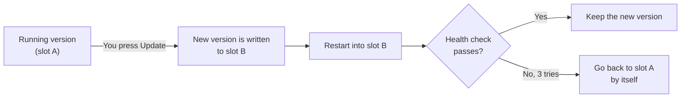

<p align="center">
  <picture>
    <source media="(prefers-color-scheme: dark)" srcset="%5BBRAND%5D/logo/jeneros-wordmark-light.svg">
    <source media="(prefers-color-scheme: light)" srcset="%5BBRAND%5D/logo/jeneros-wordmark.svg">
    
  </picture>
</p>

<h3 align="center">Your stuff lives at home.</h3>

<p align="center">
  One install turns a spare PC into your own little cloud.<br>
  Photos, files, movies and your smart home, all in one place, with one friendly dashboard.
</p>

<p align="center">
  <a href="LICENSE"></a>
  
  
</p>

<p align="center">
  <a href="#install">Install</a> ·
  <a href="#how-updates-stay-safe">Safe updates</a> ·
  <a href="#roadmap">Roadmap</a> ·
  <a href="#build-from-source">Build</a> ·
  <a href="https://jener.dev">jener.dev</a>
</p>

<!-- screenshots: docs/readme/dashboard-light.png, dashboard-dark.png -->

> [!WARNING]
> **Early preview.** JenerOS boots, shows a live dashboard, updates itself and rolls back bad updates. Most apps are still on the way. There is **no login yet**, so anyone on your home network can open the dashboard. Keep it off the internet, and don't trust it with your only copy of anything.

## What is it?

Running your own home server usually means a pile of separate tools: one for photos, one for files, one for movies, one for the smart home, one for blocking ads. Each has its own install, its own login and its own updates.

JenerOS puts all of that into one operating system. You install it once. You get one dashboard, one app store and one update button. It feels a bit like iCloud, except the box sits on your shelf and your stuff never leaves the house.

JenerOS is made by [Jener, Inc.](https://jener.dev) and is free software.

## What's inside

<table>
  <tr>
    <td width="33%" valign="top"><b>Dashboard</b><br>See your box at a glance: address, storage, memory and how busy it is.<br><sub>Works today</sub></td>
    <td width="33%" valign="top"><b>Safe updates</b><br>Press Update. If the new version fails, the old one comes back by itself.<br><sub>Works today</sub></td>
    <td width="33%" valign="top"><b>Locked-down system</b><br>A read-only, tamper-checked core that can't drift or break over time.<br><sub>Works today</sub></td>
  </tr>
  <tr>
    <td valign="top"><b>Photos</b><br>Back up every picture from every phone in the house.<br><sub>Coming soon · powered by Immich</sub></td>
    <td valign="top"><b>Drive</b><br>Your files and folders, on all your devices.<br><sub>Coming soon · powered by Nextcloud</sub></td>
    <td valign="top"><b>TV</b><br>Your movies and shows, streamed to any screen.<br><sub>Coming soon · powered by Jellyfin</sub></td>
  </tr>
  <tr>
    <td valign="top"><b>Home</b><br>Lights, plugs and sensors in one app.<br><sub>Coming soon · powered by Home Assistant</sub></td>
    <td valign="top"><b>Relay</b><br>Blocks ads and trackers for every device on your network.<br><sub>Coming soon · powered by AdGuard Home</sub></td>
    <td valign="top"><b>App Store</b><br>Add more apps in one click.<br><sub>Catalog ready, installs coming soon</sub></td>
  </tr>
  <tr>
    <td valign="top"><b>Storage</b><br>Pool your disks. Any Linux can still read them.<br><sub>Planned</sub></td>
    <td valign="top"><b>Machines</b><br>Run virtual machines and containers.<br><sub>Planned</sub></td>
    <td valign="top"><b>Router mode</b><br>Let the box run your whole home network.<br><sub>Planned, last on the list</sub></td>
  </tr>
</table>

## How updates stay safe

JenerOS keeps two copies of the system, slot A and slot B. You always run one. Updates go into the other.



- The box checks for new versions every few hours. Nothing installs until you say so.
- The system files are read-only and checked against a fingerprint (dm-verity) on every read. If something changes them, the box notices.
- Your settings and data live on a separate partition, so updates and rollbacks never touch them.

## Install

**You need:** a 64-bit PC with UEFI (most PCs from 2012 on), 4 GB of RAM, and a drive of 32 GB or more.

> [!CAUTION]
> Installing **erases the whole drive** you flash. Pick it carefully.

1. Download `jeneros_<version>.img.xz` from the [Releases page](https://github.com/PrimeExtremo/JenerOS/releases). If no release is listed yet, one is on the way.
2. Flash it onto the drive the PC will boot from. Any of these work:
   - [balenaEtcher](https://etcher.balena.io): pick the file, pick the drive, press Flash.
   - [Raspberry Pi Imager](https://www.raspberrypi.com/software/): choose **Use custom** and pick the file.
   - `dd` on Linux or macOS:
     ```bash
     xz -dc jeneros_<version>.img.xz | sudo dd of=/dev/sdX bs=4M status=progress conv=fsync
     ```
3. In the PC's firmware settings, turn **Secure Boot off**, then boot from that drive.

A USB SSD works too. An `.iso` installer that copies JenerOS onto an internal disk is planned.

<details>
<summary><b>Trying it in a virtual machine</b></summary>
<br>

Unpack the image and convert it for your hypervisor:

```bash
xz -d jeneros_<version>.img.xz
qemu-img convert -f raw -O vmdk  jeneros_<version>.img jeneros.vmdk    # VMware
qemu-img convert -f raw -O qcow2 jeneros_<version>.img jeneros.qcow2   # Proxmox / QEMU
```

Create the VM with **UEFI firmware** (Secure Boot off), 2 CPUs and 4 GB of RAM. Grow the disk to 32 GB or more before the first boot. JenerOS fills the extra space by itself.

</details>

## First boot

**Today:** when the box starts, its screen shows a line like `Dashboard: http://192.168.x.x`. Type that address into any phone or computer on the same Wi-Fi and you're in.

**Coming soon: the setup wizard.** You'll set up your box on its own screen, or from your phone: scan the QR code on the screen and type the 6-digit code it shows. The wizard will help you create your owner account, name your box, set the time zone and choose your disks. Then it gets out of the way and never shows up again.

## Build from source

JenerOS is Debian 13 "trixie", built into a disk image with [mkosi](https://github.com/systemd/mkosi). The dashboard is served by `jenerd`, a small Go service that uses only the standard library.

Builds run inside a Debian 13 VM. Set it up once with [BUILD-VM.md](%5BDOCS%5D/BUILD-VM.md), then:

```bash
./[OS]/setup-build-vm.sh                          # once: mkosi, Go, qemu-utils
RELEASE=1 VERSION=<version> ./[OS]/build.sh       # image + update files
```

More reading: [ARCHITECTURE.md](%5BDOCS%5D/ARCHITECTURE.md) · [STORAGE.md](%5BDOCS%5D/STORAGE.md) · [RELEASING.md](%5BDOCS%5D/RELEASING.md) · [App manifest format](%5BSPEC%5D/app-manifest.md)

| Folder | What's in it |
|---|---|
| `[OS]/` | Image build: mkosi config, partitions, update rules, boot splash |
| `[CORE]/` | `jenerd`, the Go service behind the dashboard |
| `[DASHBOARD]/` | The web dashboard |
| `[STORE]/` | App store catalog |
| `[BRAND]/` | Logo files |
| `[DOCS]/` | Plans, research and the work log |

## Roadmap

- [x] Boots on x86-64 PCs and in VMs
- [x] Live dashboard
- [x] Read-only, tamper-checked system with A/B updates
- [x] Automatic rollback when an update fails
- [ ] Setup wizard on screen and on your phone (QR + 6-digit code)
- [ ] Owner account and login
- [ ] Storage pools that any Linux can still read
- [ ] One-click apps: Photos, Drive, TV, Home, Relay
- [ ] One login for every app
- [ ] `.iso` installer
- [ ] Raspberry Pi 5 image
- [ ] Virtual machines and containers
- [ ] Reach your box safely from anywhere
- [ ] Router mode
- [ ] TV and phone apps
- [ ] Signed updates

The full plan lives in [ROADMAP.md](%5BDOCS%5D/ROADMAP.md).

## Contributing

JenerOS is young, and help is welcome.

- Found a bug or have an idea? [Open an issue](https://github.com/PrimeExtremo/JenerOS/issues).
- Want to send code? Read [handoff.md](handoff.md) and [AGENTS.md](AGENTS.md) first. They explain how the project is put together and the few rules we keep.
- Keep pull requests small and say how you tested them.

## License

JenerOS is free software under the [GNU General Public License v3.0 or later](LICENSE). It builds on Debian, systemd, mkosi and many other open-source projects, each under its own license. The apps in the store keep their own licenses too.

<p align="center">
  <sub>Made at home by <a href="https://jener.dev">Jener, Inc.</a></sub>
</p>
